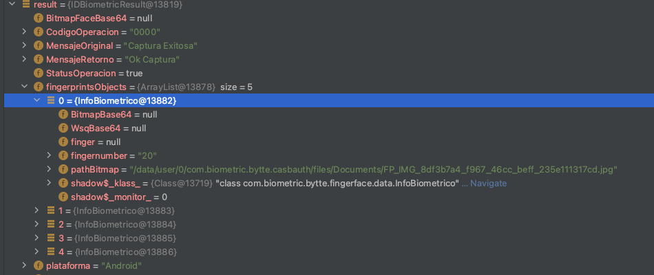

# Bytte-Mobile-ANDROID-SDK-NATIVE


<p align="center" >
  
</p>

# Bytte SDK  Android
## Integración sdk Bytte Android 
    Autor Venancio prada. 
    Fecha de creación 9 septiembre 2021.
    versión  documentación -> 2.0.0.
    Versión SDK Bytte 8.2.0


# CONFIDENCIALIDAD
La   información   contenida   en   el   presente   documento   es CONFIDENCIAL,  hace  parte  del  secreto  comercial  e  industrial de  la  empresa  e  implica  transmisión  de  información  cuya propiedad  corresponde  exclusivamente  a BYTTE  SAS.  En consecuencia,  la  divulgación  o  el uso  inapropiado  de  la información aquí contenida por parte del receptor de la misma, implicarán la aplicación de las normas legales pertinentes para su debida protección.

# Factores Limitantes 
Los factores limitantes para la integración del SDK son:

* Se debe verificar la calidad de la cámara, es recomendable utilizar dispositivos con cámara que tengan la característica de “AutoFoco” y flash.
* Se recomiendan cámaras con resolución mayores o iguales a 5 MegaPixeles frontal y 8 MegaPixeles para un óptimo rendimiento, “mejor cámara mejora las imágenes”.
* El SDK no funciona sobre dispositivos virtuales, únicamente sobre dispositivos físicos.
* No presenta inconveniente para compilaciones Android 30.
* Mínima versión soportada Android 19.
* Esta solución ya trabaja sobre androidX por lo cual si el proyecto no lo soporta se debe migrar para que la captura de los documentos funcionen.


* **Se debe verificar la calidad de la cámara, es recomendable utilizar dispositivos con cámara que tengan la característica de “Auto Foco” habilitada.**
* **Se recomiendan cámaras con resolución mayores o iguales a 8 MegaPixeles para un óptimo rendimiento.**
* **El SDK no funciona sobre dispositivos virtuales, únicamente sobre dispositivos físicos.**
* **Sistemas soportados Android 5.0 o superior gradle 4.1.2 o superior arquitecturas arm  x86,64 bits.**


# Instalación de las librerías 
En el archivo gradle build.gradle  del proyecto adicionaremos la 'URL' que nos entrega Bytte para la descarga de los archivos necesarios, al igual que el usuario y token de acceso.

>Las librerías tiene soporte tanto a 32 como a 64 bit en arm. 


```gradle 

android{ 
    defaultconfig  después de 
    versionName ingresamos 
    ndk {abiFilters  “armeabi-v7a”, "arm64-v8a"}


repositories {
        maven {
             url 'https://multifactorbyttelibrary.pkgs.visualstudio.com/BytteSDKLibraryX/_packaging/BytteSDKIdenty/maven/v1'
             name 'BytteSDKIdenty'
            credentials {
                username ""
                password ""
            }
        }
}
```

# Importamos las Librerias Bytte
En el archivo gradle *build.gradle*  adicionaremos las dependencias. 


>Estas son las librerías necesarias para el uso, funcionalidad y captura de documento colombiano, y biometría. 

## Dependencias buid.gradle 
```gradle
   
    

   
    implementation  'com.squareup.okhttp3:okhttp:4.9.1'
    implementation("com.squareup.okhttp3:logging-interceptor:4.9.0")
    implementation 'com.squareup.retrofit2:retrofit:2.9.0'
    implementation 'com.squareup.retrofit2:converter-gson:2.9.0'
    implementation 'com.jakewharton.timber:timber:4.7.1'

    implementation 'androidx.appcompat:appcompat:1.4.1'
    implementation 'androidx.legacy:legacy-support-v4:1.0.0'

    implementation  'org.jetbrains.kotlin:kotlin-stdlib:1.6.10'
    implementation  'org.jetbrains.kotlinx:kotlinx-coroutines-core:1.5.0'
    implementation 'org.jetbrains.kotlin:kotlin-android-extensions-runtime:1.6.10'


    implementation 'com.android.volley:volley:1.2.1'
    api 'com.google.android.gms:play-services-safetynet:18.0.1'


    implementation "androidx.exifinterface:exifinterface:1.3.3"
    implementation 'com.google.android.gms:play-services-vision:20.1.3'

    implementation "androidx.core:core-ktx:1.7.0"
    implementation 'org.jetbrains.kotlinx:kotlinx-coroutines-android:1.5.0'
    implementation "com.google.android.material:material:1.5.0"
    implementation 'androidx.constraintlayout:constraintlayout:2.1.3'
    implementation 'com.android.support.constraint:constraint-layout:2.0.4'

    implementation 'com.bytte.microblink:LibBlinkIDCustom:5.15.0'
    implementation 'com.document.bytte:documentBytte:8.0.3'


    implementation'com.bytte.biometric:FingerFace:8.0.5'
    implementation'com.bytte.facemlh:Face:1.0.1'
    implementation'com.bytte.indenty:fingerface:4.13.35'


```
## Manifest 
>La configuración del manifest es la siguiente: requiere permisos para el uso de internet, lectura y escritura en el dispositivo y cámara.
>Configuración de las actividades Bytte para las capturas. 
```
    <uses-permission android:name="android.permission.CAMERA" />
    <uses-permission android:name="android.permission.INTERNET" />
    <uses-permission android:name="android.permission.WRITE_EXTERNAL_STORAGE" />

    

        <!-- captura doc -->
        <activity android:name="com.bytte.docbytte.ui.FrontDocument" />
        <activity android:name="com.bytte.docbytte.ui.BackDocument" />
        <activity android:name="com.bytte.docbytte.ui.CreditCardData" /> //Si aplica

    


```

## Captura de Insumos 
El app debe solicitar los permisos  en tiempo de ejecución antes de usar la funcionalidad y validar que el permiso fue otorgado.

## Captura Documento
### Inicializar la captura. 
>Activity :Pasamos 
>new InitializationListener<IDCaptureDocumentBytte>()  :establecer los parámetros de configuración del SDK deseados, en el método onInit().
>new BytteResponseListener<String>() :callbacks donde llegara la respuesta correcta "onResponse" o errónea "onErrorResponse"
```kotlin 
  IDCaptureDocumentBytte.newInstance(Activity(), new InitializationListener<IDCaptureDocumentBytte>() {
            @Override
            public void onInit(IDCaptureDocumentBytte d) {
                d.setLicenceMicroblink(license);
                d.setKey(key);
                d.setImgColor(true);
                d.setTipoCaptura(ETipocaptura.BACK);
                d.setTimeOut(timeOut);
                d.capture();
            }
        }, new BytteResponseListener<String>() {
            @Override
            public void onResponse(String results) {

            }

            @Override
            public void onErrorResponse(String obj) {

            }
        });
```
### Configuración Parámetros  la captura. 


|onInit(IDCaptureDocumentBytte d) ||
|---------------------------------|--|
| d.setLicenceMicroblink(license)   | Licencia provista por Bytte para la captura de  los documentos.
| d.setKey(key)                       | Llave de protección para las img. Si lleva un valor diferente a vacío Esta retorna la img formato .bytte
el resultado es una imagen cifrada con aes 256 por sesión.
| d.setImgColor(true)                 | Identifica si la img está a color o blanco y negro 
| d.setTimeOut(timeOut)               | Tiempo de duración de la captura
| d.setTipoCaptura(ETipocaptura.BACK) | Identifica la  captura a generarse ETipocaptura.BACK -> reverso,  ETipocaptura.FRONT -> frontal, ETipocaptura.QR captura qr, ETipocaptura.FRONT_BACK captura frente dorso en la misma captura rotando el documento cuando se indique 
| d.setTipoDocumento(ETipoDocumento.DOCUMENT)| Identifica el tipo capturara. Documento actual ejm Colombia cédula amarilla este valor está predefinido. Se modifica si se requiere la captura de tarjeta de identidad, cédula física digital, o cédula extranjería. Por el momento estas últimas capturas están integradas capturando las dos caras en la misma escena
|d.capture()|  Lanza la captura con los parámetros de inicialización definidos.
|


## Licenciamiento Biometría Huellas y Rostro
### Parámetros
## Licencia  Android para el uso de huellas
* **Crear una carpeta en el directorio android llamada 'assets'.**
Dentro de esa carpeta depositamos el archivo de licencia que se genera para la implementación en 'debug' y otra, reléase.


## Captura Biometría huellas 
### Parámetros
>fingercallback-> Callback de respuesta genera un success o fail y el detalle. 

>finger ->Identifica la mano que quiero capturar: enviamos el dedo  #2, mano derecha, dedo #7,  mano izquierda.

>namePath-> El nombre del archivo de la licencia ejm: 1148_com.biometric.bytte.casbauth2021-06-09 00 00 00.lic

> netkey -> parametro en vacio 
> Url ->  url Provisto por bytte para la inicialización parámetro requerido para su funcionamiento.
> key -> Llave de protección para las img. si lleva un valor diferente a vacío Esta retorna la img formato .bytte
el resultado es una imagen cifrada con aes 256 por sesión.


``` kotlin

     // segunos


        ResponseIDBiometric callback = new ResponseIDBiometric() {
            @Override
            public void objBiometricResoult(IDBiometricResult result) {

            }
        };

        IDCaptureBiometric idfinger = new IDCaptureBiometric(namePath, netkey, callback, reactContext.getCurrentActivity());
        idfinger.captureInitFingerprint("Url","key",finger);

```    
## Configuración colores de la pantalla de huellas
>boxes -> Color de borde  del cuadro de la cámara.
>boxes_transparent -> Color del recuadro  entre el header y el footer.
>colorPrimary -> Color del footer y el header. 

    ```  xml
    <color name="boxes">#FF5722</color>
    <color name="boxes_transparent">#FF5722</color>
    <color name="colorPrimary">#FFC107</color>
    <color name="colorPrimaryDark">#FF5722</color>

    ```
## Configuración en español para mensajes huellas
Vamos a la carpeta res/values/strings.xml

``` xml
 <string name="id_searching_left">Buscando dedos izquierdos…</string>
    <string name="id_searching_right">Buscando dedos derechos…</string>


        <string name="id_authentication_retake">INSEGURO VOLVER A TOMAR</string>
        <string name="id_authentication_successful">Autenticado</string>
        <string name="id_authentication_unsuccessful">Autenticación incorrecta</string>
        <string name="id_capture_completed">Captura completada</string>
        <string name="id_captured">Capturado</string>
        <string name="id_capturing">Capturando..</string>
        <string name="id_close">Cerrar</string>
        <string name="id_confirm_exit">Confirmar salida</string>
        <string name="id_continue">SEGUIR</string>
        <string name="id_dshow_again">No me lo muestres de nuevo</string>
        <string name="id_enrollment_completed">INSCRIPCIÓN FINALIZADA</string>
        <string name="id_exit_text">¿Quieres salir de la captura?</string>
        <string name="id_good_quality">Todo de buena calidad</string>
        <string name="id_hand_closer">Por favor acerca la mano</string>
        <string name="id_hand_further_away">Mueva la mano más lejos</string>
        <string name="id_hand_further_away_ff">Mueva la mano más lejos 4F</string>
        <string name="id_hold_0">Por favor sostenga</string>
        <string name="id_hold_1">Por favor sostenga 1</string>
        <string name="id_hold_2">Por favor sostenga 2</string>
        <string name="id_hold_3">Por favor sostenga 3</string>
        <string name="id_hold_4">Por favor sostenga 4</string>
        <string name="id_hold_5">Por favor sostenga 5</string>
        <string name="id_hold_6">Por favor sostenga 6</string>
        <string name="id_hold_still">Asegúrate de mantenerte quieto hasta la captura automática. </string>
        <string name="id_identy_template_format">Formato de plantilla IDENTY</string>
        <string name="id_image_cd_todo">QUE HACER</string>
        <string name="id_in_front_camera">2.Coloque los dedos frente a la cámara</string>
        <string name="id_index">INDICE    </string>
        <string name="id_index_finger">dedo índice</string>
        <string name="id_inside_guide">Por favor, esté dentro de la guía.</string>
        <string name="id_keep_fingers">1.Extiende y mantén los dedos juntos</string>
        <string name="id_keep_fingers_together">mantener los dedos juntos</string>
        <string name="id_left_thumb"> PULGAR IZQUIERDO</string>
        <string name="id_little">PEQUEÑO   </string>
        <string name="id_little_finger">dedo índice</string>
        <string name="id_location_error_off">Algo es extraño APAGADO</string>
        <string name="id_middle">MEDIO   </string>
        <string name="id_middle_finger">dedo medio</string>
        <string name="id_next">SIGUIENTE</string>
        <string name="id_next_detection">Pasar a la siguiente mano ?</string>
        <string name="id_next_hand_confirm">Siguiente detección Confirmar</string>
        <string name="id_no">NO</string>
        <string name="id_no_match">SIN COINCIDENCIA</string>
        <string name="id_not_good_quality">no tiene buena calidad.</string>
        <string name="id_ok">OK</string>
        <string name="id_pic_qc_title">FALLO EN LA CALIDAD DE LA IMAGEN</string>
        <string name="id_processing">Procesando …</string>
        <string name="id_qc_retake">Necesitamos retomar la foto</string>
        <string name="id_quality_failed">Falló la calidad de la imagen</string>
        <string name="id_retake_additional_tip">Consejos adicionales</string>
        <string name="id_retake_match">Se alcanzó el número máximo de intentos, inténtelo de nuevo</string>
        <string name="id_retake_q">volver a tomar?</string>
        <string name="id_retake_string">volver a tomar</string>
        <string name="id_retake_tip_1">Tus dedos miran hacia la cámara</string>
        <string name="id_retake_tip_2">Tus dedos están dentro de la caja azul</string>
        <string name="id_retake_tip_3">Utilice iluminación interior normal</string>
        <string name="id_retry">Procesar de nuevo</string>
        <string name="id_right_thumb">PULGAR DERECHO</string>
        <string name="id_ring">ANILLO     </string>
        <string name="id_ring_finger">dedo anular</string>
        <string name="id_select_hand">por favor seleccione al menos una mano</string>
        <string name="id_spoof">PARODIA</string>
        <string name="id_spoof_additional_tip">Consejos adicionales</string>
        <string name="id_spoof_question">¿Estás usando manos reales para autenticarte?</string>
        <string name="id_spoof_tip_2">Utilice iluminación interior normal  </string>
        <string name="id_spoof_tip_3">Intente intentar una ubicación / fondo diferente</string>
        <string name="id_spoof_title">Spoof detectado</string>
        <string name="id_stable">Por favor sea estable</string>
        <string name="id_stay_still_blue">3.Quédate quieto dentro del rectángulo azul</string>
        <string name="id_success">Éxito</string>
        <string name="id_success_match"> MATCH EXITOSO</string>
        <string name="id_thumb">PULGAR    </string>
        <string name="id_thumb_finger">dedo índice</string>
        <string name="id_try_again">Intentar otra vez</string>
        <string name="id_try_again_in">Inténtelo de nuevo en : </string>
        <string name="id_wait_auto">4.Espere la captura automática (hasta que se apague el flash)</string>
        <string name="id_wsq_compression">Relación de compresión WSQ</string>
        <string name="id_yes">SI</string>
        <string name="id_zero">0</string>
```


## Captura Biometría facial 
### Parámetros
>fingercallback-> Callback de respuesta genera un success o fail y el detalle. 

>finger ->Identifica la mano que quiero capturar: enviamos el dedo  #2, mano derecha, dedo #7,  mano izquierda.

>namePath-> El nombre del archivo de la licencia ejm: 1148_com.biometric.bytte.casbauth2021-06-09 00 00 00.lic

> netkey -> parametro en vacio 
> Url ->  url Provisto por bytte para la inicialización parámetro requerido para su funcionamiento.
> key -> Llave de protección para las img. si lleva un valor diferente a vacío Esta retorna la img formato .bytte
el resultado es una imagen cifrada con aes 256 por sesión.
> camara >camara frontal 1 camara posterior.  valor numerico 

``` kotlin

        ResponseIDBiometric callback = new ResponseIDBiometric() {
            @Override
            public void objBiometricResoult(IDBiometricResult result) {

            }
        };

        IDCaptureBiometric idface = new IDCaptureBiometric(namePath, netkey, callback, reactContext.getCurrentActivity());
        idface.captureInitFaceprint("url","key",camara)

```


## Configuración colores de la pantalla de facial
### Colores para personalizar la vista 
Estos colores se toman de la configuración de la app 
>id_box -> Color del mensaje 
>id_face_boxes -> Color del borde
>colorPrimary -> Color del footer y el header 
```
  
    <color name="id_box">#FF5722</color>
    <color name="id_face_boxes">#8BC34A</color>
```


### Información que retorna para captura del documento cédula de ciudadanía

* Retorno: se retorna en la variable un String results_Doc “objeto JSON”con los siguientes datos:
* La información retornada es:
    * * Version Cédula. 
      * 02 –Cédula de Ciudadanía.
      * 03 –Cédula de Ciudadanía.
      * I3 –Tarjeta de Identidad.
      * NumeroTarjeta: Numero de plástico.
      * NumeroCédula.
      * PrimerApellido.
      * SegundoApellido.
      * PrimerNombre.
      * SegundoNombre.
      * NombresCompletos.
      * Sexo.
      * FechaNacimiento.
      * RH.
      * TipoDedo(Dedo impreso en el documento) dedo principal impreso en el documento.
      * TipoDedo2 segunda huella. 
      * La identifiación de los dedos es: 1 –Derecho Pulgar, 2 –Derecho Índice, 3 –Derecho Medio, 4 –Derecho Anular, 5 –Derecho Meñique, 6        –Izquierdo Pulgar, 7 –Izquierdo Índice, 8 –Izquierdo Medio, 9 –Izquierdo Anular, 10 –Izquierdo Meñique, 20 –Mano derecha, 21 –Mano        izquierda.
      * BarcodeBase64: Código de barras en base64 que se requiere para procesos posteriores.
      * PathImagen: Ubicación donde se almacenó la imagen del documento (esta puede ser eliminada por la aplicación cuando ya no se requiera)  (la imagen se retorna de tamaño 640x480 independiente de la calidad de la cámara del dispositivo).


Tarjeta de identidad
* {
  "CodigoOperacion":"0000",
  "Frente":{"PathImagen":"/data/user/0/com.biometric.bytte.casbauth/files/Documents/DB_IMG_c2dd0b5a_617c_4374_a94c_159ce6391140.jpg","PathImagenRostro":"/data/user/0/com.biometric.bytte.casbauth/files/Documents/DB_IMG_df7e6888_6a37_4996_b006_53037012dd7f.jpg","NumeroCedula":"941120-10550"},"MensajeOriginal":"Captura exitosa","MensajeRetorno":"Ok Captura","Reverso":{"PathImagen":"/data/user/0/com.biometric.bytte.casbauth/files/Documents/DB_IMG_14d38a11_8492_48cc_aac9_7814f2eaba2e.jpg","Apellidos":"GAMBA PEDROZO","BarcodeBase64":"//h0q6x/3p2VkEJSnSP4AAAAAAAAAAAAAAAAAAAAAAAAAADcCMABSVf+AgFeQXXVpn1ebYKJpcHdfaal4bEybR51wfH5/02g8lJpWz2zbeZON3414ioeUO3hIenKRcVOCZ0mqv3WKb8dtjYePapZinHycjpuDlKk6Z0ZeVU5HdVhvWmRrVmGZaVN9UzhMLUXqtb9/VUndf2nEAAAAAAAAAAAAAAAAAAAAAAAAAAAAAAAAAAAAAAAAAAAAAAAAAAAAAAAAWHviVG/e3Wk3cFhOq/uitmEFCMmSr5+h9lM6LYf49eN2bA0iuOEZDg\u003d\u003d","FechaNacimiento":"1994/11/20","Nombres":"ELIANA ","NombresCompletos":" CONSUELO  ","NumeroCedula":"102365","NumeroTarjeta":"24799519","PrimerApellido":"GAM","PrimerNombre":"ELIANA","RH":"O+","SegundoApellido":"PE","SegundoNombre":"CONS","Sexo":"F","TipoDedo1":"2","TipoDedo2":"7","VersionCedula":"I3"},"StatusOperacion":true}


Cédula de extranjería 

* {
  "CodigoOperacion": "0000",
  "Frente": {
    "PathImagen": "/data/user/0/com.biometric.bytte.casbauth/files/Documents/DB_IMG_3d541510_adbd_4475_8993_da5f970c4c00.jpg",
    "PathImagenRostro": "/data/user/0/com.biometric.bytte.casbauth/files/Documents/DB_IMG_cce5e57a_701f_400f_a77a_51399a903199.jpg",
    "FechaExpiracion": "2022/06/03",
    "FechaNacimiento": "1981/02/25",
    "NumeroCedula": "5437753"
  },
  "MensajeOriginal": "Captura exitosa",
  "MensajeRetorno": "Ok Captura",
  "StatusOperacion": true,
  "ReversoMRZ": {
    "PathImagen": "/data/user/0/com.biometric.bytte.casbauth/files/Documents/DB_IMG_d7f0f511_8787_469b_b454_d54a53a62705.jpg",
    "Apellidos": "LOPEZ ",
    "CodigoDocumento": "I",
    "Edad": "40",
    "Emisor": "COL",
    "FechaExpiracion": "220603",
    "FechaNacimiento": "810225",
    "MRZ": "I\u003cCOL5437753\u003c\u003c6\u003c\u003c\u003c\u003c\u003c\u003c\u003c\u003c\u003c\u003c\u003c\u003c\u003c\u003c\u003c\n8102254F2206035PER\u003c\u003c\u003c\u003c\u003c\u003c\u003c\u003c\u003c\u003c\u003c4\nLOPEZ\u003cFERNANDEZ\u003c\u003cZOILA\u003cELVIRA\u003c\n",
    "Nacionalidad": "PER",
    "Nombres": " ",
    "NombresCompletos": "",
    "NumeroDocumento": "543",
    "OPT": "\u003c\u003c\u003c\u003c\u003c\u003c\u003c\u003c\u003c\u003c\u003c\u003c\u003c\u003c\u003c",
    "RUN": "543",
    "Sexo": "F",
    "TipoDocumento": "I",
    "Version1": "3"
  }
}


Cédula digital 

* {
  "CodigoOperacion":"0000",
  "Frente": {"PathImagen":"/data/user/0/com.biometric.bytte.casbauth/files/Documents/DB_IMG_c9ff6f8d_48ef_4d42_b230_d1578c619a91.jpg","PathImagenRostro":"/data/user/0/com.     biometric.bytte.casbauth/files/Documents/DB_IMG_148da3e8_33bc_418c_b63f_990707da6e52.jpg","FechaExpiracion":"07 ABR 2031","FechaNacimiento":"20 SEPT 1986","NumeroCedula":"1069716751"},"MensajeOriginal":"Captura exitosa","MensajeRetorno":"Ok Captura","StatusOperacion":true,"ReversoMRZ":{"PathImagen":"/data/user/0/com.biometric.bytte.casbauth/files/Documents/DB_IMG_207613ae_3213_4e98_9853_32777ac9e7ad.jpg","Apellidos":"PRADA NAVARRO","CodigoDocumento":"IC","Edad":"34","Emisor":"COL","FechaExpiracion":"310407","FechaNacimiento":"860920",
  
  "MRZ":"ICCOL000310431215094\u003c\u003c\u003c\u003c\u003c\u003c\u003c\u003c\u003c\u003c\n8609203M3104079COL1069716751\u003c0\nPRADA\u003cNAVARRO\u003c\u003cVENANCIO\u003c\u003c\u003c\u003c\u003c\u003c\u003c\n","Nacionalidad":"COL","Nombres":"VENANCIO","NombresCompletos":"VENANCIO PRADA NAVARRO","NumeroDocumento":"1069716751","OPT":"15094\u003c\u003c\u003c\u003c\u003c\u003c\u003c\u003c\u003c\u003c","RUN":"000310431","Sexo":"M","TipoDocumento":"IC","Version1":"2"}}
 
Huellas
<p align="center" >
  
</p>


 Rostro  

* {
    "BitmapFaceBase64": "xxxxxxxxxxxxxsxsxsadasdaswzxsaxsxa",
    "CodigoOperacion":"0000",
    "MensajeOriginal":"Captura Exitosa",
    "MensajeRetorno":"Ok Captura",
    "StatusOperacion":true
    }
 

------------------------------
# Código de errores 

```
<string name="OK">0000</string><string name="TimeOut">0001</string>
<string name="Cancelado_a_proposito">0002</string>
<string name="Error_de_Licencia_MicroBlink">0111</string>
<string name="Error_No_tiene_permisos_camara">0112</string>
<string name="Error_de_Licencia_Biometria">0113</string>
<string name="Error_Captura_de_huellas">0114</string>


<string name="timeOut">TimeOut</string>
<string name="Canceladoproposito">Cancelado a proposito</string>
<string name="ErrorLicencia_MicroBlink">Error de Licencia MicroBlink"</string>
<string name="ErrorLicencia_Biometria">Error de Licencia biometría"</string>
<string name="Error_Capturahuellas">Error en la captura de las huellas"</string>
<string name="ErrorLicenciaBiometria">Error licencia de  biometría"</string>

------------------------------
Control de cambios
------------------------------

